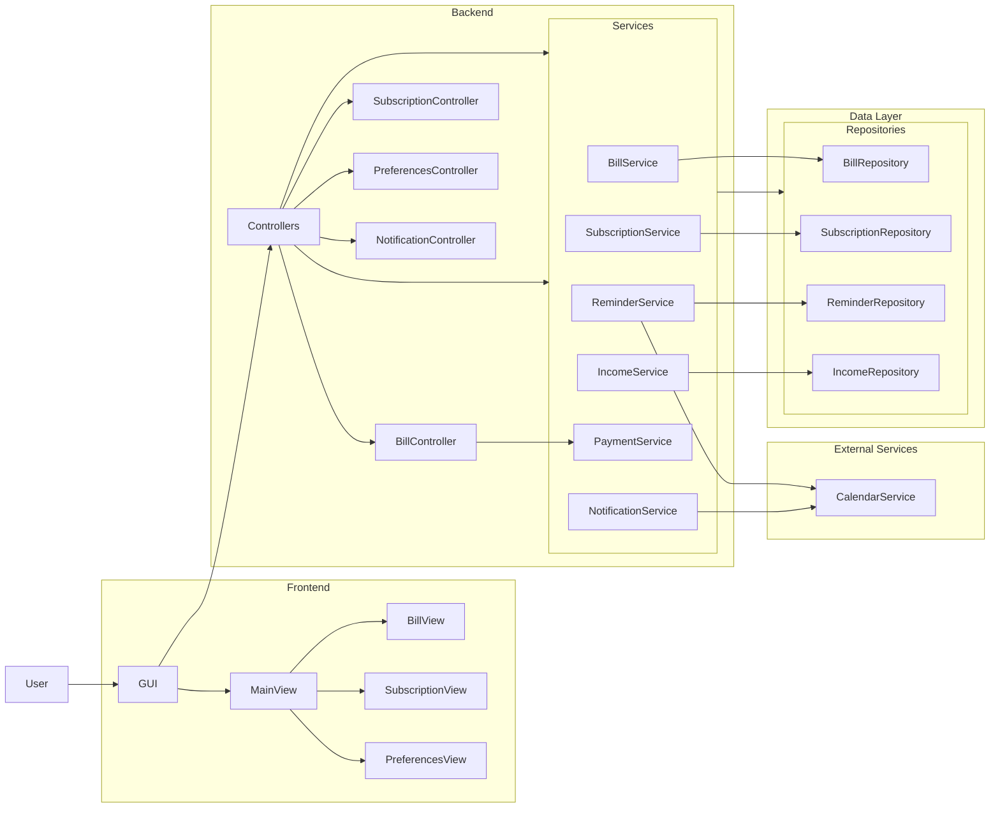

```mermaid
graph LR
    %% Frontend
    subgraph Frontend [Frontend]
        GUI --> MainView
        MainView --> BillView
        MainView --> SubscriptionView
        MainView --> PreferencesView
    end

    %% Backend
    subgraph Backend [Backend]
        Controllers --> BillController
        Controllers --> SubscriptionController
        Controllers --> PreferencesController
        Controllers --> NotificationController

        Controllers --> Services
        subgraph Services [Services]
            BillService
            SubscriptionService
            ReminderService
            NotificationService
            PaymentService
            IncomeService
        end
    end

    %% Data Layer
    subgraph DataLayer [Data Layer]
        Repositories
        subgraph Repositories [Repositories]
            BillRepository
            SubscriptionRepository
            ReminderRepository
            IncomeRepository
        end
    end

    %% External Services
    subgraph ExternalServices [External Services]
        CalendarService
    end

    %% Interactions
    GUI --> Controllers
    Controllers --> Services
    Services --> Repositories
    ReminderService --> CalendarService

    %% Relations
    User --> GUI
    BillController --> PaymentService
    BillService --> BillRepository
    SubscriptionService --> SubscriptionRepository
    ReminderService --> ReminderRepository
    IncomeService --> IncomeRepository
    NotificationService --> CalendarService
```