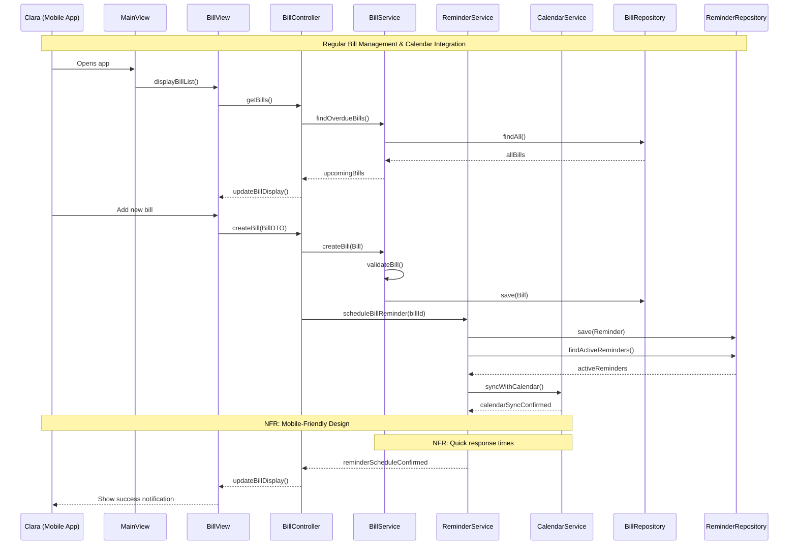

```mermaid 
sequenceDiagram
    participant C as Clara (Mobile App)
    participant MV as MainView
    participant BV as BillView
    participant BC as BillController
    participant BS as BillService
    participant RS as ReminderService
    participant CS as CalendarService
    participant BR as BillRepository
    participant RR as ReminderRepository
    
    Note over C,RR: Regular Bill Management & Calendar Integration
    
    C->>MV: Opens app
    MV->>BV: displayBillList()
    BV->>BC: getBills()
    BC->>BS: findOverdueBills()
    BS->>BR: findAll()
    BR-->>BS: allBills
    BS-->>BC: upcomingBills
    BC-->>BV: updateBillDisplay()
    
    C->>BV: Add new bill
    BV->>BC: createBill(BillDTO)
    BC->>BS: createBill(Bill)
    BS->>BS: validateBill()
    BS->>BR: save(Bill)
    
    BC->>RS: scheduleBillReminder(billId)
    RS->>RR: save(Reminder)
    RS->>RR: findActiveReminders()
    RR-->>RS: activeReminders
    RS->>CS: syncWithCalendar()
    CS-->>RS: calendarSyncConfirmed
    
    Note over C,CS: NFR: Mobile-Friendly Design
    Note over BS,CS: NFR: Quick response times
    
    RS-->>BC: reminderScheduleConfirmed
    BC-->>BV: updateBillDisplay()
    BV-->>C: Show success notification
```