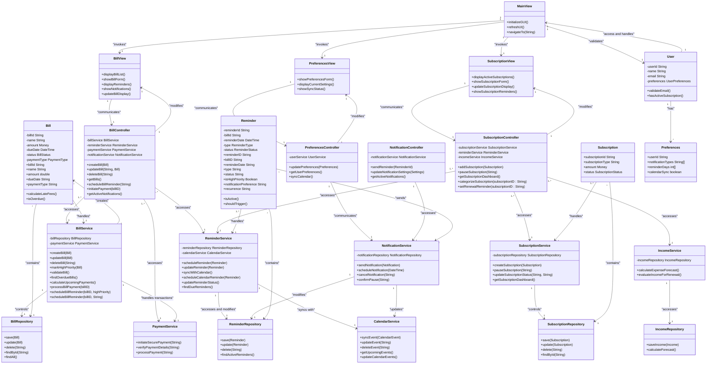

```mermaid 
classDiagram
    %% Payment Service
    class PaymentService {
        +initiateSecurePayment(String)
        +verifyPaymentDetails(String)
        +processPayment(String)
    }

    %% View Layer - GUI Model
    class BillView {
        +displayBillList()
        +showBillForm()
        +displayReminders()
        +showNotifications()
        +updateBillDisplay()
    }

    class PreferencesView {
        +showPreferencesForm()
        +displayCurrentSettings()
        +showSyncStatus()
    }

    class SubscriptionView {
        +displayActiveSubscriptions()
        +showSubscriptionForm()
        +updateSubscriptionDisplay()
        +showSubscriptionReminders()
    }

    class MainView {
        +initializeGUI()
        +refreshUI()
        +navigateTo(String)
    }

    %% Controller Layer
    class BillController {
        -billService BillService
        -reminderService ReminderService
        -paymentService PaymentService
        -notificationService NotificationService
        +createBill(Bill)
        +updateBill(String, Bill)
        +deleteBill(String)
        +getBills()
        +scheduleBillReminder(String)
        +initiatePayment(billID)
        +getActiveNotifications()
    }

    class SubscriptionController {
        -subscriptionService SubscriptionService
        -reminderService ReminderService
        -incomeService IncomeService
        +addSubscription(Subscription)
        +pauseSubscription(String)
        +getSubscriptionDashboard()
        +categorizeSubscription(subscriptionID : String)
        +setRenewalReminder(subscriptionID : String)
    }

    class PreferencesController {
        -userService UserService
        +updatePreferences(Preferences)
        +getUserPreferences()
        +syncCalendar()
    }

    class NotificationController {
        -notificationService NotificationService
        +sendReminder(ReminderId)
        +updateNotificationSettings(Settings)
        +getActiveNotifications()
    }

    %% Model Layer - Domain Models
    class Bill {
        -billId String
        -name String
        -amount Money
        -dueDate DateTime
        -status BillStatus
        -paymentType PaymentType
        +calculateLateFees()
        +isOverdue()
    }

    class User {
        -userId String
        -name String
        -email String
        -preferences UserPreferences
        +validateEmail()
        +hasActiveSubscription()
    }

    class Reminder {
        -reminderId String
        -billId String
        -reminderDate DateTime
        -type ReminderType
        -status ReminderStatus
        +isActive()
        +shouldTrigger()
    }

    %% Service Layer
    class BillService {
        -billRepository BillRepository
        -paymentService PaymentService
        +createBill(Bill)
        +updateBill(Bill)
        +deleteBill(String)
        +markHighPriority(Bill)
        +validateBill()
        +findOverdueBills()
        +calculateUpcomingPayments()
        +processBillPayment(billID)
        +scheduleBillReminder(billID, highPriority)
        +scheduleBillReminder(billID, String)
    }

    class SubscriptionService {
        -subscriptionRepository SubscriptionRepository
        +createSubscription(Subscription)
        +pauseSubscription(String)
        +updateSubscriptionStatus(String, String)
        +getSubscriptionDashboard()
    }

    class ReminderService {
        -reminderRepository ReminderRepository
        -calendarService CalendarService
        +scheduleReminder(Reminder)
        +updateReminder(Reminder)
        +syncWithCalendar()
        +scheduleCalendarReminder(Reminder)
        +updateReminderStatus()
        +findDueReminders()
    }

    class NotificationService {
        -notificationRepository NotificationRepository
        +sendNotification(Notification)
        +scheduleNotification(DateTime)
        +cancelNotification(String)
        +confirmPause(String)
    }

    class IncomeService {
        -incomeRepository IncomeRepository
        +calculateExpenseForecast()
        +evaluateIncomeForRenewal()
    }

    %% Repository Layer
    class BillRepository {
        +save(Bill)
        +update(Bill)
        +delete(String)
        +findById(String)
        +findAll()
    }

    class SubscriptionRepository {
        +save(Subscription)
        +update(Subscription)
        +delete(String)
        +findById(String)
    }

    class ReminderRepository {
        +save(Reminder)
        +update(Reminder)
        +delete(String)
        +findActiveReminders()
    }

    class IncomeRepository {
        +saveIncome(Income)
        +calculateForecast()
    }

    %% External Services
    class CalendarService {
        +syncEvent(CalendarEvent)
        +updateEvent(String)
        +deleteEvent(String)
        +getUpcomingEvents()
        +updateCalendarEvents()
    }

    %% DTOs
    class Bill {
        +billId String
        +name String
        +amount double
        +dueDate String
        +paymentType String
    }

    class Subscription {
        +subscriptionId String
        +subscriptionType String
        +amount Money
        +status SubscriptionStatus
    }

    class Preferences {
        +userId String
        +notificationTypes String[]
        +reminderDays int[]
        +calendarSync boolean
    }

    class Reminder {
        +reminderID String
        +billID String 
        +reminderDate String
        +type String 
        +status String
        +isHighPriority Boolean
        +notificationPreference String
        +recurrence String
    }

    %% Relationships 
    MainView "1" --> "1" BillView : "invokes"
    MainView "1" --> "1" PreferencesView : "invokes"
    MainView "1" --> "1" SubscriptionView : "invokes"
    BillView "1" --> "1" BillController : "communicates"
    PreferencesView "1" --> "1" PreferencesController : "communicates"
    SubscriptionView "1" --> "1" SubscriptionController : "communicates"
    BillView "1" <-- "1" BillController : "modifies"
    PreferencesView "1" <-- "1" PreferencesController : "modifies"
    SubscriptionView "1" <-- "1" SubscriptionController : "modifies"
    BillController "1..*" --> "1" BillService : "accesses"
    BillController "1..*" --> "1" ReminderService : "accesses"
    BillController "1..*" --> "1" PaymentService : "accesses"
    SubscriptionController "1..*" --> "1" SubscriptionService : "accesses"
    SubscriptionController "1..*" --> "1" ReminderService : "accesses"
    SubscriptionController "1..*" --> "1" IncomeService : "accesses"
    BillService "1" --> "1" BillRepository : "controls"
    BillService "1" --> "1" Payment Service : "handles transactions"
    SubscriptionService "1" --> "1" SubscriptionRepository : "controls"
    PreferencesController "1" --> "1" NotificationService : "communicates"
    NotificationController "1" --> "1" NotificationService : "accesses"
    ReminderService "1" --> "1" ReminderRepository : "accesses and modifies"
    ReminderService "1" --> "1" CalendarService : "syncs with"
    NotificationService "1" --> "1" ReminderRepository : "modifies"
    NotificationService "1" --> CalendarService : "updates"
    IncomeService "1" --> "1" IncomeRepository : "accesses"
    Subscription "*" --> "1" SubscriptionRepository : "contains"
    Subscription "1..*" --> "1" SubscriptionService : "handles"
    Reminder "*" --> "1" ReminderRepository : "contains"
    Bill "*" --> "1" BillRepository : "contains" 
    Bill "1..*" --> "1" BillService : "handles"
    Bill "*" <-- "1" BillService : "creates"
    Reminder "1..*" --> "1" ReminderService : "handles"
    Reminder "*" --> "1" NotificationService : "sends" 
    User "1" --> "*" Preferences : "has"
    User "1" --> "1" MainView : "access and handles" 
    MainView "1" --> "1" User : "validates"


```