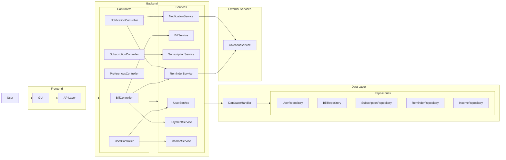

```mermaid
graph LR
    %% Frontend
    subgraph Frontend [Frontend]
        GUI --> APILayer
    end

    %% Backend
    subgraph Backend [Backend]
        subgraph Controllers [Controllers]
            BillController
            SubscriptionController
            PreferencesController
            NotificationController
            UserController
        end
        subgraph Services [Services]
            UserService
            BillService
            SubscriptionService
            ReminderService
            NotificationService
            PaymentService
            IncomeService
        end
    end

    %% Data Layer
    subgraph DataLayer [Data Layer]
        DatabaseHandler --> Repositories
        subgraph Repositories [Repositories]
            UserRepository
            BillRepository
            SubscriptionRepository
            ReminderRepository
            IncomeRepository
        end
    end

    %% External Services
    subgraph ExternalServices [External Services]
        CalendarService
    end

    %% Interactions
    APILayer --> Controllers
    Controllers --> Services
    Services --> DatabaseHandler
    ReminderService --> CalendarService

    %% Relations
    User --> GUI
    BillController --> PaymentService
    BillController --> BillService
    BillController --> ReminderService
    SubscriptionController --> SubscriptionService
    UserController --> UserService
    UserController --> IncomeService
    NotificationController --> NotificationService
    NotificationController --> ReminderService
    
    NotificationService --> CalendarService
```