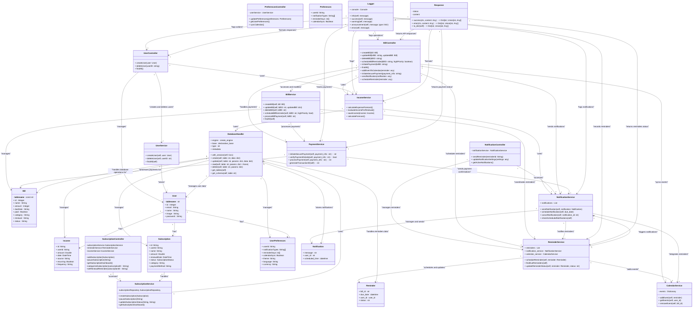

```mermaid
classDiagram
    %% New Service for Income Management
    class IncomeService {
        + calculateExpenseForecast()
        + evaluateIncomeForRenewal()
        + saveIncome(income: Income)
        + calculateForecast()
    }

    %% New Domain Classes
    class Income {
        + id: String
        + userId: String
        + amount: Double
        + date: DateTime
        + source: String
        + recurring: Boolean
        + frequency: String
    }

    class Subscription {
        + id: String
        + userId: String
        + name: String
        + amount: Double
        + renewalDate: DateTime
        + status: SubscriptionStatus
        + category: String
        + paymentMethod: String
    }

    class SubscriptionController {
        -subscriptionService SubscriptionService
        -reminderService ReminderService
        -incomeService IncomeService
        +addSubscription(Subscription)
        +pauseSubscription(String)
        +getSubscriptionDashboard()
        +categorizeSubscription(subscriptionID : String)
        +setRenewalReminder(subscriptionID : String)
    }

    class SubscriptionService {
        -subscriptionRepository SubscriptionRepository
        +createSubscription(Subscription)
        +pauseSubscription(String)
        +updateSubscriptionStatus(String, String)
        +getSubscriptionDashboard()
    }

    class UserPreferences {
        + userId: String
        + notificationTypes: String[]
        + reminderDays: int[]
        + calendarSync: Boolean
        + theme: String
        + language: String
        + currency: String
    }

    %% New Controller Layer Classes
    class PreferencesController {
        - userService : UserService
        + updatePreferences(preferences: Preferences)
        + getUserPreferences()
        + syncCalendar()
    }

    class NotificationController {
        - notificationService : NotificationService
        + sendReminder(reminderId: String)
        + updateNotificationSettings(settings: any)
        + getActiveNotifications()
    }

    %% New Model Layer Types and Classes
    class Preferences {
        + userId: String
        + notificationTypes: String[]
        + reminderDays: int[]
        + calendarSync: Boolean
    }

    %% Existing classes from ClassDiagram.md (referenced but not modified)
    %% Payment Section
    class PaymentService {
        + initiateSecurePayment(self, payment_info : str) : str
        + verifyPaymentDetails(self, payment_info : str) : bool
        + processPayment(self, payment_info : str) : str
        - generateTransactionID(self) : str
    }

    %% Bill Section 
    class BillService {
        + createBill(self, bill: Bill)
        + updateBill(self, billID: str, updatedBill: dict)
        + deleteBill(self, billID: str)
        + scheduleBillReminder(self, billID: str, highPriority: bool)
        + processBillPayment(self, billID: str)
        + findAll(self)
    }

    class Bill {
        - __tablename__ : const str
        + id : Integer
        + name : String
        + amount : Integer
        + dueDate : String
        + paid : Boolean
        + category : String
        + renewal : String
        + status : String
    }
    
    class BillController {
        + createBill(bill: Bill)
        + updateBill(billID: string, updatedBill: Bill)
        + deleteBill(billID: string)
        + scheduleBillReminder(billID: string, highPriority: boolean)
        + initiatePayment(billID: string)
        + findAll()
        + addEventToCalendar(reminder: any)
        + initiateSecurePayment(payment_info: string)
        + sendNotification(notification: any)
        + scheduleReminder(reminder: any)
    }

    %% Calendar Service 
    class Calendar Service {
        - events : Dictionary
        + addEvent(self, reminder)
        + getEvents(self, user_id)
        + removeEvent(self, bill_id)
    }

    %% Notification Section
    class Notification {
        + message : str
        + user_id : str
        + scheduled_time : datetime
    }

    class NotificationService {
        + notifications : List<Notification>
        + sendNotification(self, notification: Notification)
        + scheduleNotification(self, due_date)
        + cancelNotification(self, notification_id: str)
        + checkScheduledNotifications(self)
    }

    %% Reminder Section
    class Reminder {
        + bill_id : str 
        + due_date : datetime
        + user_id : user_id
        + status : str
    }

    class ReminderService {
        + reminders : List<Reminder>
        + notification_service : NotificationService
        + calendar_service : CalendarService 
        + scheduleReminder(self, reminder: Reminder)
        + findDueReminders(self)
        + updateReminderStatus(self, reminder: Reminder, status: str)
    }

    %% User Section
    class UserService {
        + createUser(self, user: User)
        + deleteUser(self, userID: str)
        + findAll(self)
    }

    class User{
        - __tablename__ : str
        + id : Integer
        + email : String 
        + name : String
        + image : String 
        + password : String
    }

    class UserController {
        + createUser(user: User)
        + deleteUser(userID: string)
        + findAll()
    }

    %% Database Handler Section
    class DatabaseHandler {
        + engine : create_engine
        + base : declarative_base
        + type : str
        + metadata 
        + with_session(self, func)
        + create(self, table: str, data: dict)
        + update(self, table: str, params: dict, data: dict)
        + read(self, table: str, params: dict = None)
        + delete(self, table: str, params: dict)
        + get_tables(self)
        + get_schema(self, table: str)
    }

    class Logger {
        + console : Console
        + info(self, message)
        + success(self, message)
        + warning(self, message)
        + announcement(self, message, type='info')
        + error(self, message)
    }

    class Response {
        - status 
        - content 
        + success(cls, content: Any) -> Dict[str, Union[str, Any]]
        + error(cls, content: Any) -> Dict[str, Union[str, Any]]
        + to_dict(self) -> Dict[str, Union[str, Any]]
    }

    %% Relationships
    DatabaseHandler "1" --> "*" Income: "manages"
    DatabaseHandler "1" --> "*" Subscription: "manages"
    DatabaseHandler "1" --> "*" UserPreferences: "manages"
    IncomeService "1" --> "1" DatabaseHandler: "uses"
    IncomeService "1" --> "1" NotificationService: "uses"
    User "1" --> "1" UserPreferences: "has"
    User "1" --> "*" Income: "has"
    User "1" --> "*" Subscription: "has"
    BillController "1" --> "1" IncomeService: "uses"
    UserController "1" --> "1" IncomeService: "uses"
    Logger "1" --> "1" IncomeService: "logs"
    Response "1" --> "1" IncomeService: "formats"
    NotificationController "1" --> "1" NotificationService : "accesses"
    NotificationController "1" --> "1" ReminderService : "manages reminders"
    SubscriptionController "1..*" --> "1" SubscriptionService : "accesses"
    SubscriptionService "1" --> "1" DatabaseHandler : "uses"
    Subscription "1..*" --> "1" SubscriptionService : "handles"
    BillController "1" --> "1" BillService : "accesses and modifies"
    BillController "1" --> "1" PaymentService : "handles payments"
    BillController "1" --> "1" ReminderService : "schedules reminders"
    BillController "1" --> "1" CalendarService : "syncs events"
    BillController "1" --> "1" NotificationService : "sends notifications"
    BillService "1" --> "*" Bill : "manages"
    BillService "1" --> "1" PaymentService : "processes payments"
    BillService "1" --> "1" ReminderService : "coordinates reminders"
    ReminderService "1" --> "*" Reminder : "schedules and updates"
    ReminderService "1" --> "1" NotificationService : "triggers notifications"
    ReminderService "1" --> "1" CalendarService : "adds events"
    NotificationService "1" --> "*" Notification : "manages and sends"
    NotificationService "1" --> "1" CalendarService : "integrates reminders"
    NotificationService "1" --> "1" ReminderService : "notifies reminders"
    UserController "1" --> "1" UserService : "creates and deletes users"
    UserController "1" --> "*" User : "manages"
    UserService "1" --> "*" User : "stores"
    PaymentService "1" --> "*" Bill : "processes payments for"
    PaymentService "1" --> "1" NotificationService : "sends payment confirmations"
    DatabaseHandler "1" --> "*" Bill : "handles database operations for"
    DatabaseHandler "1" --> "*" User : "manages user data"
    DatabaseHandler "1" --> "*" Reminder : "handles reminders data"
    DatabaseHandler "1" --> "*" Notification : "stores notifications"
    Logger "1" --> "1" BillController : "logs operations"
    Logger "1" --> "1" UserController : "logs actions"
    Logger "1" --> "1" PaymentService : "tracks payments"
    Logger "1" --> "1" ReminderService : "records reminders"
    Logger "1" --> "1" NotificationService : "logs notifications"
    Response "1" --> "1" BillController : "returns API responses"
    Response "1" --> "1" UserController : "formats responses"
    Response "1" --> "1" PaymentService : "returns payment status"
    Response "1" --> "1" ReminderService : "returns reminders status"
```