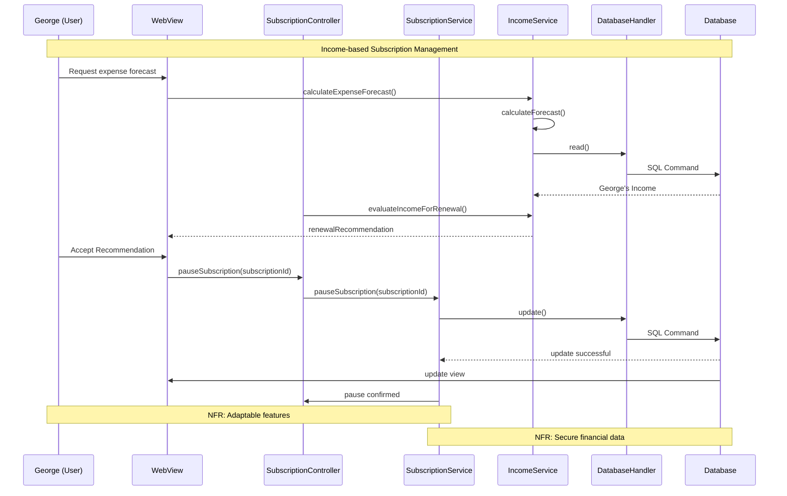

```mermaid 
sequenceDiagram
    participant G as George (User)
    participant WV as WebView
    participant SC as SubscriptionController
    participant SS as SubscriptionService 
    participant IS as IncomeService 
    participant DBH as DatabaseHandler
    participant DB as Database

    Note over G,DB: Income-based Subscription Management

    G->>WV: Request expense forecast 
    WV->>IS: calculateExpenseForecast()
    IS->>IS: calculateForecast()
    IS->>DBH: read()
    DBH->>DB: SQL Command
    DB-->>IS: George's Income
    
    SC->>IS: evaluateIncomeForRenewal()
    IS-->>WV: renewalRecommendation

    G->>WV: Accept Recommendation
    WV->>SC: pauseSubscription(subscriptionId)
    SC->>SS: pauseSubscription(subscriptionId)
    SS->>DBH: update()
    DBH->>DB: SQL Command
    DB-->>SS: update successful
    DB->>WV: update view
    SS->>SC: pause confirmed 

    Note over G,SS: NFR: Adaptable features
    Note over SS,DB: NFR: Secure financial data
```