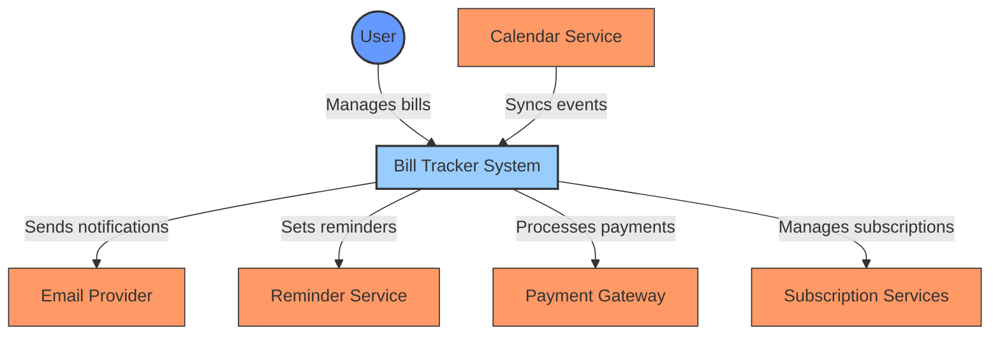

```mermaid
graph TB
    %% External Actors and Systems
    User((User))
    PaymentGateway[Payment Gateway]
    EmailProvider[Email Provider]
    SubscriptionServices[Subscription Services]
    CalendarService[Calendar Service]
    ReminderService[Reminder Service]
    
    %% Central System
    subgraph BillTracker[Bill Tracker System]
    end
    
    %% Top Relationships
    User -->|"Manages bills"| BillTracker
    CalendarService -->|"Syncs events"| BillTracker
    
    %% Right Relationships
    BillTracker -->|"Sends notifications"| EmailProvider
    BillTracker -->|"Sets reminders"| ReminderService
    
    %% Left Relationships
    BillTracker -->|"Processes payments"| PaymentGateway
    BillTracker -->|"Manages subscriptions"| SubscriptionServices
    
    %% Styling
    classDef system fill:#9cf,stroke:#333,stroke-width:2px
    classDef external fill:#f96,stroke:#333
    classDef actor fill:#69f,stroke:#333,stroke-width:2px
    
    class BillTracker system
    class User actor
    class PaymentGateway,EmailProvider,SubscriptionServices,CalendarService,ReminderService external
```