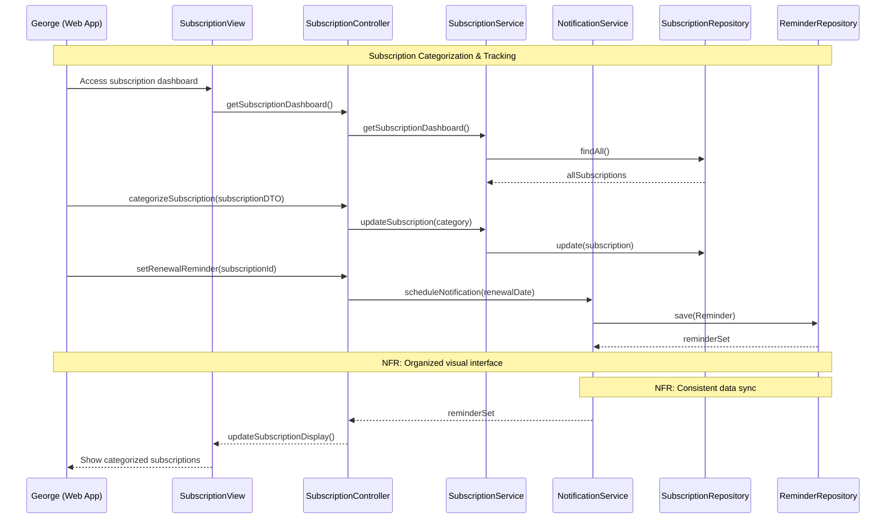

```mermaid
sequenceDiagram
    participant G as George (Web App)
    participant SV as SubscriptionView
    participant SC as SubscriptionController
    participant SS as SubscriptionService
    participant NS as NotificationService
    participant SR as SubscriptionRepository
    participant RR as ReminderRepository
    
    Note over G,RR: Subscription Categorization & Tracking
    
    G->>SV: Access subscription dashboard
    SV->>SC: getSubscriptionDashboard()
    SC->>SS: getSubscriptionDashboard()
    SS->>SR: findAll()
    SR-->>SS: allSubscriptions
    
    G->>SC: categorizeSubscription(subscriptionDTO)
    SC->>SS: updateSubscription(category)
    SS->>SR: update(subscription)
    
    G->>SC: setRenewalReminder(subscriptionId)
    SC->>NS: scheduleNotification(renewalDate)
    NS->>RR: save(Reminder)
    RR-->>NS: reminderSet
    Note over G,RR: NFR: Organized visual interface
    Note over RR,NS: NFR: Consistent data sync
    
    NS-->>SC: reminderSet
    SC-->>SV: updateSubscriptionDisplay()
    SV-->>G: Show categorized subscriptions
```