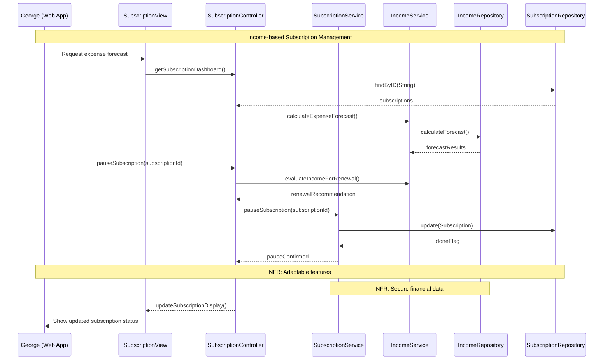

```mermaid
sequenceDiagram
    participant G as George (Web App)
    participant SV as SubscriptionView
    participant SC as SubscriptionController
    participant SS as SubscriptionService
    participant IS as IncomeService
    participant IR as IncomeRepository
    participant SR as SubscriptionRepository
    
    Note over G,SR: Income-based Subscription Management
    
    G->>SV: Request expense forecast
    SV->>SC: getSubscriptionDashboard()
    SC->>SR: findByID(String)
    SR-->>SC: subscriptions
    SC->>IS: calculateExpenseForecast()
    IS->>IR: calculateForecast()
    IR-->>IS: forecastResults
    
    G->>SC: pauseSubscription(subscriptionId)
    SC->>IS: evaluateIncomeForRenewal()
    IS-->>SC: renewalRecommendation
    
    SC->>SS: pauseSubscription(subscriptionId)
    SS->>SR: update(Subscription)
    SR-->>SS: doneFlag
    SS-->>SC: pauseConfirmed
    
    Note over G,SR: NFR: Adaptable features
    Note over SS,IR: NFR: Secure financial data
    
    SC-->>SV: updateSubscriptionDisplay()
    SV-->>G: Show updated subscription status
```