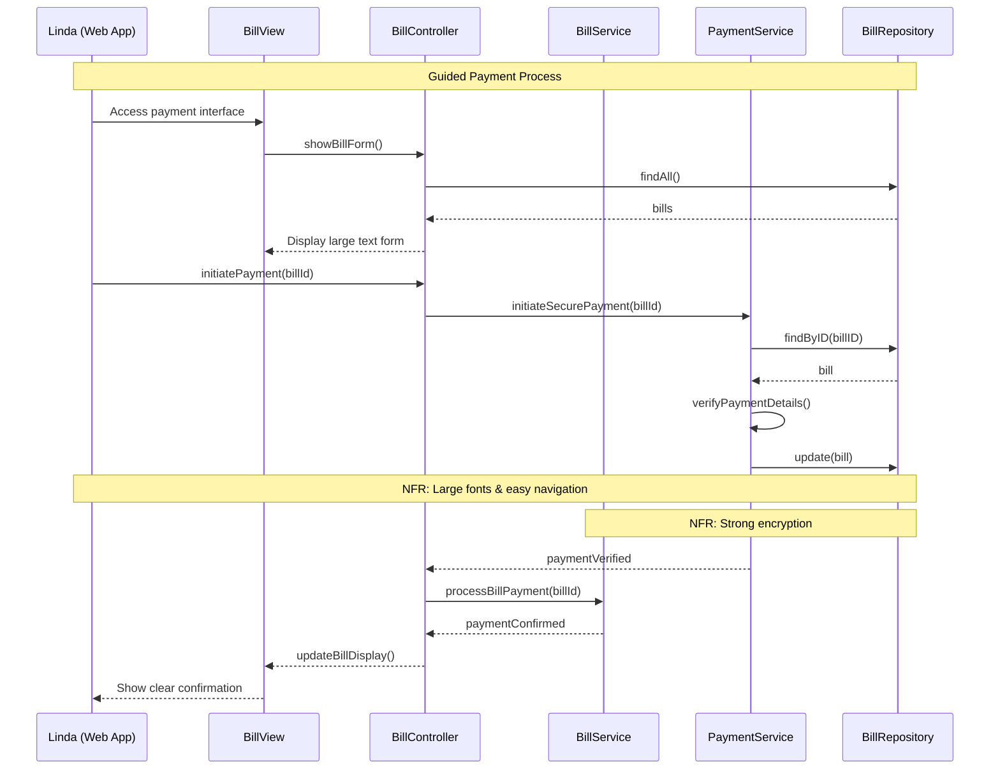

```mermaid
sequenceDiagram
    participant L as Linda (Web App)
    participant BV as BillView
    participant BC as BillController
    participant BS as BillService
    participant PS as PaymentService
    participant BR as BillRepository
    
    Note over L,BR: Guided Payment Process
    
    L->>BV: Access payment interface
    BV->>BC: showBillForm()
    BC->>BR: findAll()
    BR-->>BC: bills

    BC-->>BV: Display large text form
    
    L->>BC: initiatePayment(billId)
    BC->>PS: initiateSecurePayment(billId)
    PS->>BR: findByID(billID)
    BR-->>PS: bill

    PS->>PS: verifyPaymentDetails()
    PS->>BR: update(bill)
    
    Note over L,BR: NFR: Large fonts & easy navigation
    Note over BS,BR: NFR: Strong encryption
    
    PS-->>BC: paymentVerified
    BC->>BS: processBillPayment(billId)
    BS-->>BC: paymentConfirmed
    
    BC-->>BV: updateBillDisplay()
    BV-->>L: Show clear confirmation
```