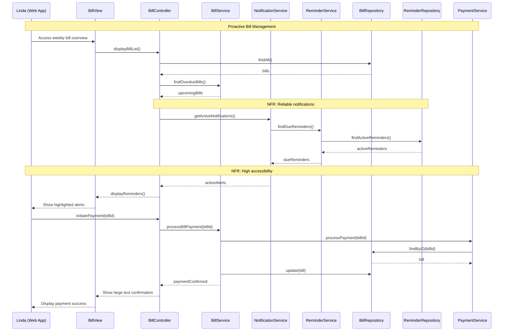

```mermaid
sequenceDiagram
    participant L as Linda (Web App)
    participant BV as BillView
    participant BC as BillController
    participant BS as BillService
    participant NS as NotificationService
    participant RS as ReminderService
    participant BR as BillRepository 
    participant RR as ReminderRepository
    participant PS as PaymentService
    Note over L,PS: Proactive Bill Management
    
    L->>BV: Access weekly bill overview
    BV->>BC: displayBillList()
    BC->>BR: findAll()
    BR-->>BC: bills
    BC->>BS: findOverdueBills()
    BS-->>BC: upcomingBills
    
    Note over BC,RR: NFR: Reliable notifications
    BC->>NS: getActiveNotifications()
    NS->>RS: findDueReminders()
    RS->>RR: findActiveReminders()
    RR-->>RS: activeReminders
    RS-->>NS: dueReminders
    
    Note over L,PS: NFR: High accessibility
    
    NS-->>BC: activeAlerts
    BC-->>BV: displayReminders()
    BV-->>L: Show highlighted alerts
    
    L->>BC: initiatePayment(billId)
    BC->>BS: processBillPayment(billId)
    BS->>PS: processPayment(billId)
    PS->>BR: findByID(billId)
    BR-->>PS: bill

    BS->>BR: update(bill)
    BS-->>BC: paymentConfirmed
    BC-->>BV: Show large text confirmation
    BV-->>L: Display payment success
```