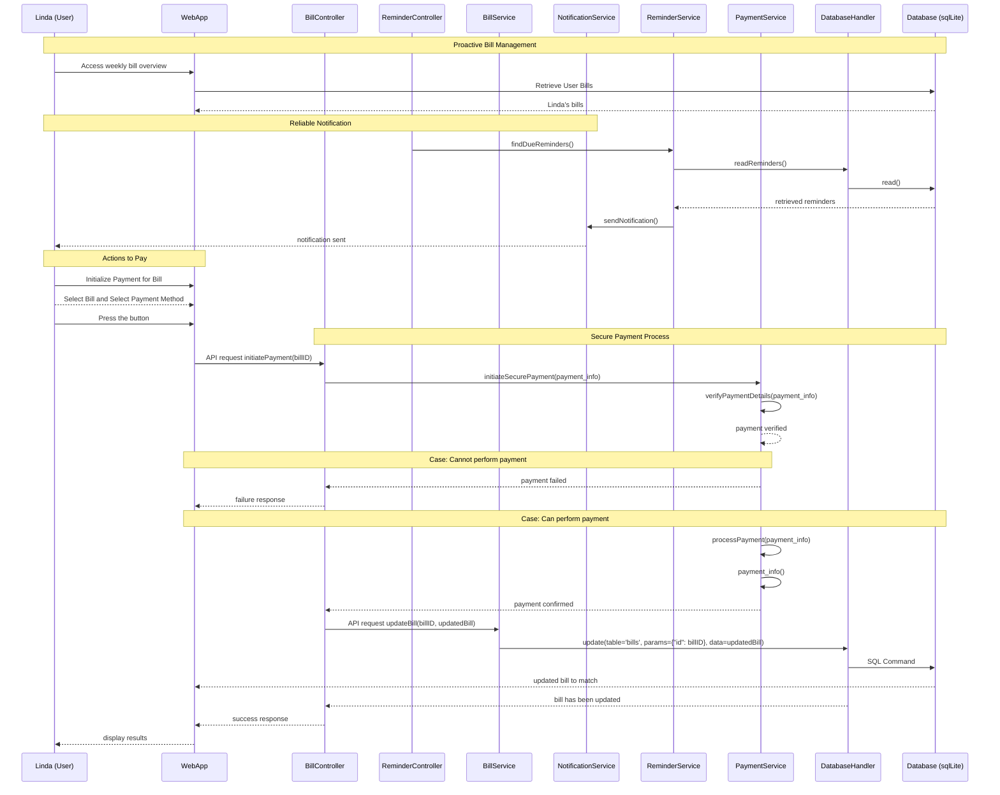

```mermaid 
sequenceDiagram
    participant L as Linda (User)
    participant WB as WebApp 
    participant BC as BillController
    participant RC as ReminderController
    participant BS as BillService
    participant NS as NotificationService
    participant RS as ReminderService
    participant PS as PaymentService
    participant DBH as DatabaseHandler
    participant DB as Database (sqlLite)

    Note over L, DB: Proactive Bill Management
    L->>WB: Access weekly bill overview
    WB->>DB: Retrieve User Bills
    DB-->>WB: Linda's bills

    Note over L, NS: Reliable Notification
    RC->>RS: findDueReminders()
    RS->>DBH: readReminders()
    DBH->>DB: read()
    DB-->>RS: retrieved reminders
    RS->>NS: sendNotification()
    NS-->>L: notification sent

    Note over L,WB: Actions to Pay
    L->>WB: Initialize Payment for Bill
    L-->>WB: Select Bill and Select Payment Method
    L->>WB: Press the button

    Note over BC,DB: Secure Payment Process
    WB->>BC: API request initiatePayment(billID)
    BC->>PS: initiateSecurePayment(payment_info)
    PS->>PS: verifyPaymentDetails(payment_info)

    PS-->>PS: payment verified
    Note over WB,PS: Case: Cannot perform payment
    PS-->>BC: payment failed
    BC-->>WB: failure response

    Note over WB,DB: Case: Can perform payment
    PS->>PS: processPayment(payment_info)
    PS->>PS: payment_info()
    PS-->>BC: payment confirmed
    BC->>BS: API request updateBill(billID, updatedBill)
    BS->>DBH: update(table='bills', params={"id": billID}, data=updatedBill)
    DBH->>DB: SQL Command
    DB-->>WB: updated bill to match
    DBH-->>BC: bill has been updated
    BC-->>WB: success response 
    WB-->>L: display results
```