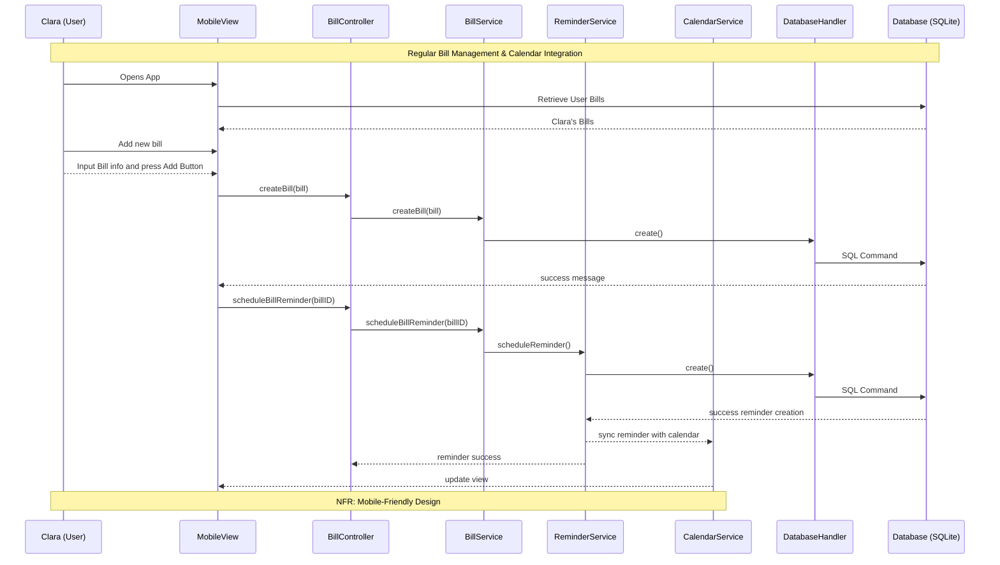

```mermaid
sequenceDiagram
    participant C as Clara (User)
    participant MV as MobileView
    participant BC as BillController
    participant BS as BillService
    participant RS as ReminderService
    participant CS as CalendarService
    participant DBH as DatabaseHandler
    participant DB as Database (SQLite)

    Note over C, DB: Regular Bill Management & Calendar Integration
    C->>MV: Opens App
    MV->>DB: Retrieve User Bills 
    DB-->>MV: Clara's Bills 

    C->>MV: Add new bill
    C-->>MV: Input Bill info and press Add Button
    MV->>BC: createBill(bill)
    BC->>BS: createBill(bill)
    BS->>DBH: create()
    DBH->>DB: SQL Command
    DB-->>MV: success message
    MV->>BC: scheduleBillReminder(billID)
    BC->>BS: scheduleBillReminder(billID)
    BS->>RS: scheduleReminder()
    RS->>DBH: create()
    DBH->>DB: SQL Command
    DB-->>RS: success reminder creation
    RS-->>CS: sync reminder with calendar
    RS-->>BC: reminder success
    CS-->>MV: update view

    Note over C,CS: NFR: Mobile-Friendly Design

```