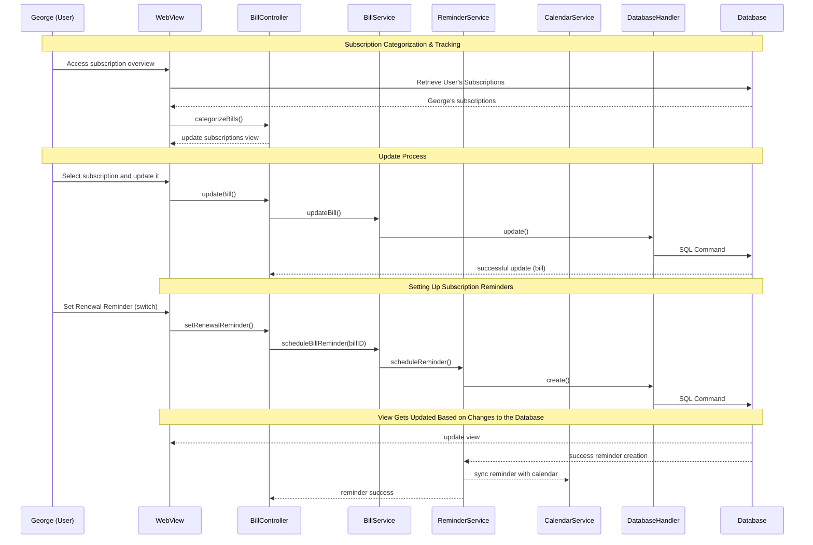

```mermaid 
sequenceDiagram
    participant G as George (User)
    participant WB as WebView
    participant BC as BillController
    participant BS as BillService
    participant RS as ReminderService
    participant CS as CalendarService
    participant DBH as DatabaseHandler
    participant DB as Database

    Note over G, DB: Subscription Categorization & Tracking 
    G->>WB: Access subscription overview
    WB->>DB: Retrieve User's Subscriptions 
    DB-->>WB: George's subscriptions
    WB->>BC: categorizeBills()
    BC-->>WB: update subscriptions view

    Note over G, DB: Update Process
    G->>WB: Select subscription and update it 
    WB->>BC: updateBill()
    BC->>BS: updateBill()
    BS->>DBH: update()
    DBH->>DB: SQL Command
    DB-->>BC: successful update (bill)

    Note over WB, DB: Setting Up Subscription Reminders
    G->>WB: Set Renewal Reminder (switch)
    WB->>BC: setRenewalReminder()
    BC->>BS: scheduleBillReminder(billID)
    BS->>RS: scheduleReminder()
    RS->>DBH: create()
    DBH->>DB: SQL Command

    Note over WB, DB: View Gets Updated Based on Changes to the Database
    DB-->>WB: update view
    DB-->>RS: success reminder creation
    RS-->>CS: sync reminder with calendar
    RS-->>BC: reminder success
     
```