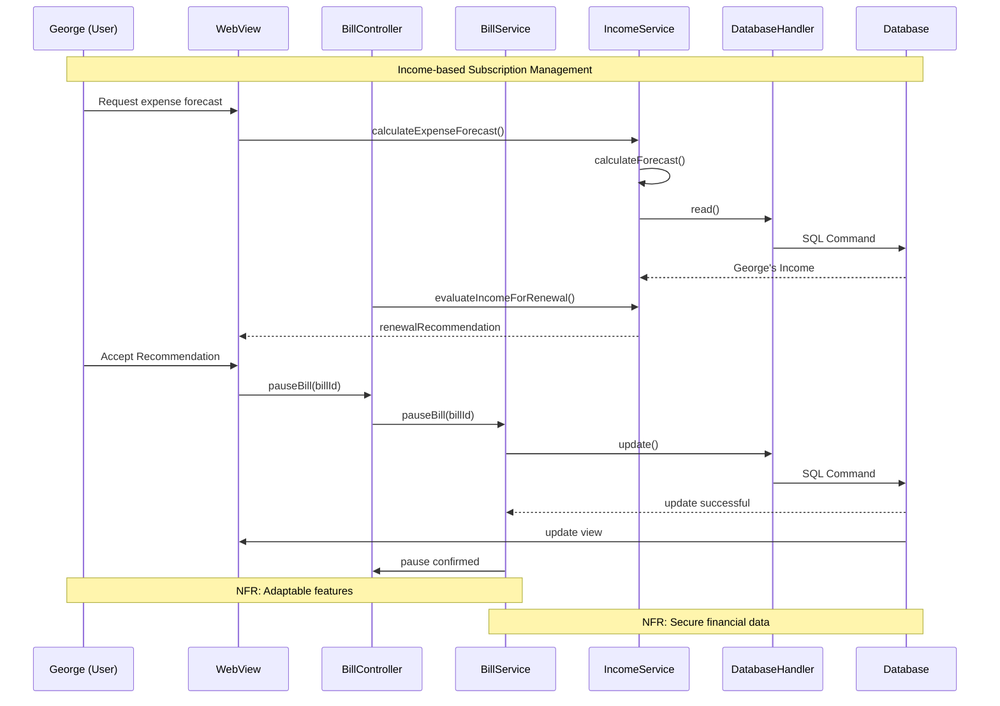

```mermaid 
sequenceDiagram
    participant G as George (User)
    participant WV as WebView
    participant BC as BillController
    participant BS as BillService 
    participant IS as IncomeService 
    participant DBH as DatabaseHandler
    participant DB as Database

    Note over G,DB: Income-based Subscription Management

    G->>WV: Request expense forecast 
    WV->>IS: calculateExpenseForecast()
    IS->>IS: calculateForecast()
    IS->>DBH: read()
    DBH->>DB: SQL Command
    DB-->>IS: George's Income
    
    BC->>IS: evaluateIncomeForRenewal()
    IS-->>WV: renewalRecommendation

    G->>WV: Accept Recommendation
    WV->>BC: pauseBill(billId)
    BC->>BS: pauseBill(billId)
    BS->>DBH: update()
    DBH->>DB: SQL Command
    DB-->>BS: update successful
    DB->>WV: update view
    BS->>BC: pause confirmed 

    Note over G,BS: NFR: Adaptable features
    Note over BS,DB: NFR: Secure financial data
    
```